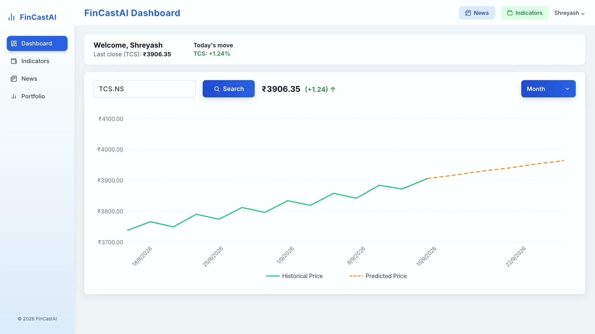
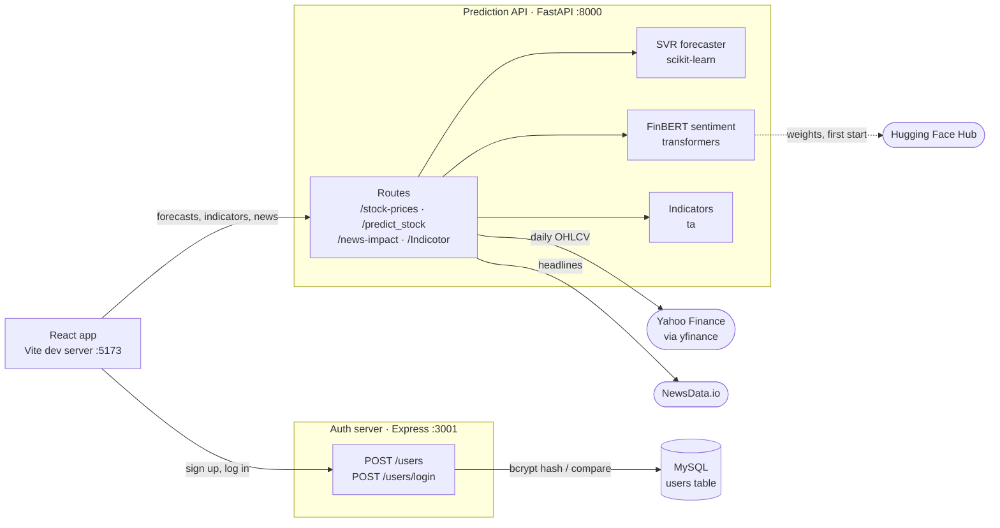

# FinCastAI

Short-horizon price forecasts, FinBERT news sentiment and technical signals for NSE-listed Indian stocks, in one dashboard.

[](./LICENSE)


FinCastAI is a full-stack web app for exploring NSE-listed Indian stocks. Search a ticker and it pulls the price history from Yahoo Finance, trains a Support Vector Regression model on it, and charts a seven-trading-day forecast against the history. Recent headlines from NewsData.io are scored with FinBERT: the sentiment nudges the forecast and, together with RSI, drives a Buy / Sell / Hold / Avoid call shown alongside EMA, MACD, Bollinger Bands and OBV. It is an educational project (see the [disclaimer](#disclaimer)), built from a React frontend, a FastAPI service for data and ML, and a separate Express + MySQL service for accounts.

<!-- TODO: add 1–2 sentences on why you built this and where it stands. The code can't tell a reader that. -->

**Contents:** [Demo](#demo) · [Features](#key-features) · [Tech stack](#tech-stack) · [Architecture](#architecture) · [Getting started](#getting-started) · [Usage](#usage) · [Project structure](#project-structure) · [Testing](#testing-and-quality) · [Limitations and roadmap](#limitations-and-roadmap) · [Contributing](#contributing) · [License](#license)

## Demo

<!-- TODO: add a live demo URL if the app is deployed -->

[](brag-output/brag.mp4)

A 20-second launch video: [brag-output/brag.mp4](brag-output/brag.mp4). The dashboard in it is rebuilt from `StockPrediction.tsx` for animation, so the prices on screen are illustrative, not model output.

<!-- TODO: add real screenshots of the running app (dashboard forecast, Indicators page, News page) -->

## Key features

- **Price forecasts:** an RBF-kernel SVR, trained per request on daily prices since 2020, predicts the next seven trading days. Weekends and the configured NSE holidays are skipped.
- **News sentiment:** NewsData.io headlines are scored by FinBERT in one batch. The mean signed score (−1 to 1) moves the forecast by up to ±10%, and the News page tags each headline Positive, Negative or Neutral.
- **Indicators and a trade call:** EMA (20), RSI (14), MACD, Bollinger Bands and OBV from the last month of prices, combined with sentiment into Buy, Sell, Hold, Avoid or No Action depending on whether you already hold the stock.
- **Market snapshot:** the landing page shows the latest price and day-over-day change for NSE large caps, fetched in a single batched Yahoo Finance call and cached for 60 seconds.
- **Interactive chart:** solid historical and dashed predicted series (Recharts) with All Time, Year, Month and Week zoom plus a range brush. Typing `TCS` completes to `TCS.NS`.
- **Accounts:** sign-up and login against MySQL with bcrypt-hashed passwords, plus an operator CLI for forced password resets.
- **Explicit errors, offline tests:** 404, 422 and 502 responses carry readable messages, and the pytest and Vitest suites run without network access, a model download or a database.

## Tech stack

| Area | Stack |
| --- | --- |
| Frontend | React 19, TypeScript 5, Vite 6, Tailwind CSS 4, React Router 7, Recharts 2, Axios, lucide-react |
| Prediction API | Python, FastAPI, Uvicorn, Pydantic response models |
| Data and ML | scikit-learn (SVR, StandardScaler), Hugging Face Transformers + PyTorch (FinBERT), pandas, NumPy, ta, yfinance |
| Auth server | Node.js, Express 5, TypeScript via ts-node, mysql2, bcryptjs |
| Data stores and services | MySQL (users), Yahoo Finance, NewsData.io, Hugging Face Hub (model weights) |
| Testing and tooling | pytest + httpx, Vitest 5 + Supertest, ESLint 9 + typescript-eslint |

JavaScript versions are the major versions declared in each `package.json`. The Python dependencies in [requirements.txt](backend/requirements.txt) are unpinned.

## Architecture

FinCastAI runs as three independent processes. The React app calls both backends directly, and the backends never call each other.



- **Prediction API** ([backend/app/main.py](backend/app/main.py)): one FastAPI module that owns market data and ML. FinBERT loads once at startup; data downloads, model training and indicator maths happen per request.
- **Auth server** ([server/src/server.ts](server/src/server.ts)): two Express routes over a MySQL `users` table.
- **Frontend** ([frontend/src](frontend/src)): React Router pages. [services/api.ts](frontend/src/services/api.ts) is the only place backend URLs are configured.

Login returns `{ id, name, email }`, which the browser keeps in `localStorage` to greet the user. No session or token is issued, and the prediction API does not check authentication.

### How a forecast is made

`GET /predict_stock?ticker=TCS.NS`, which is what the dashboard calls, runs these steps in `predict_stock` ([main.py](backend/app/main.py)):

1. Download daily OHLCV for the ticker from Yahoo Finance, from 2020-01-01 to today by default.
2. Fetch Indian news for the company (the ticker without its suffix, e.g. `TCS`) from NewsData.io and score it with FinBERT, giving a sentiment `s` between −1 and 1.
3. Build features (Open, High, Low, Close, Volume and `s`) with the close `forecast_out` sessions later as the target (default 7).
4. Standardise, then fit `SVR(kernel="rbf", C=1e3, gamma=0.1)` on 80% of the rows that have a known target. MSE, RMSE, MAE, MAPE and R² on the other 20% are printed to the server log.
5. Predict from the latest `forecast_out` rows and scale the result by `1 + 0.1 × s`.
6. Date the forecast on the following trading days, skipping weekends and the holidays listed in [config.py](backend/app/config.py).

### How the trade call is made

`POST /Indicotor` computes the indicators from one month of daily prices, then applies this rule, with sentiment measured as above:

| Sentiment | RSI | You hold the stock | Decision |
| --- | --- | --- | --- |
| above 0.05 | below 70 | either | Buy |
| below −0.05 | above 30 | yes | Sell |
| below −0.05 | above 30 | no | Avoid |
| anything else | any | yes | Hold |
| anything else | any | no | No Action |

### Design decisions

- **Train on demand.** There is no stored model. Each forecast fits a fresh scaler and SVR on the requested window, so results follow the latest data at the cost of latency on every request.
- **Batch the slow parts.** FinBERT scores all of a request's headlines in one call. `/stock-prices` fetches every ticker in one yfinance download and caches the result for 60 seconds behind a lock. `/predict` takes the current quote from the frame it already downloaded instead of making a second call.
- **Real status codes.** An unknown ticker returns 404, a window too short to train on returns 422, and a failing dependency returns 502, each with a `detail` message that the dashboard displays as-is.
- **bcrypt with a forced-reset path.** Passwords are bcrypt hashes (10 rounds). Accounts from before hashing were blanked by [migration 001](server/migrations/001_force_password_reset.sql) and get `403 PASSWORD_RESET_REQUIRED` until an operator sets a new password. There is deliberately no self-service reset: without email verification it would be an account-takeover route.
- **Offline tests.** [conftest.py](backend/tests/conftest.py) replaces `transformers.pipeline` before the app is imported, Yahoo Finance and NewsData.io are faked, and the auth tests mock the MySQL connection.

## Getting started

### Prerequisites

- **Python 3.9+** with pip <!-- TODO: pin a Python version; nothing in the repo declares one (no requires-python or .python-version) -->
- **Node.js 22.12+ or 24+** with npm. The auth server's test runner (Vitest 5) requires it; the frontend alone runs on Node 20+.
- A **[NewsData.io](https://newsdata.io) API key** for news and sentiment.
- **MySQL**, only if you want sign-up and login.
- About 440 MB of disk and an internet connection for the FinBERT download on the API's first start.

Run each service in its own terminal, starting from the repository root.

### 1. Clone

```bash
git clone https://github.com/shreyuu/FinCastAI.git
cd FinCastAI
```

### 2. Prediction API

```bash
cd backend
python3 -m venv .venv
source .venv/bin/activate          # Windows: .venv\Scripts\activate
pip install -r requirements.txt
cp .env.example .env               # then set NEWS_API_KEY
uvicorn app.main:app --reload
```

Start it from `backend/` so the `app` package resolves. The API listens on http://localhost:8000, with interactive docs at http://localhost:8000/docs. To use `HOST` and `PORT` from `.env` instead, run `python -m app.main` (no auto-reload).

### 3. Frontend

```bash
cd frontend
npm install
cp .env.example .env               # optional: the defaults point at localhost
npm run dev
```

Open http://localhost:5173. Forecasts, indicators and news work at this point, without an account: go to http://localhost:5173/dashBoard and search for `TCS.NS`.

### 4. Accounts (optional): MySQL and the auth server

The repo has no schema file for the `users` table. This minimal table matches the queries in [server.ts](server/src/server.ts); create it in the database you will name in `DB_NAME`:

```sql
CREATE TABLE users (
  id       INT AUTO_INCREMENT PRIMARY KEY,
  name     VARCHAR(255) NOT NULL,
  email    VARCHAR(255) NOT NULL UNIQUE,
  password VARCHAR(255) NOT NULL,   -- bcrypt hash
  dob      DATE         NOT NULL,   -- the sign-up form sends YYYY-MM-DD
  gender   VARCHAR(16)  NOT NULL    -- Male, Female or Other
);
```

<!-- TODO: replace with the real schema (e.g. a server/migrations/000_create_users.sql) if one exists -->

```bash
cd server
npm install
cp .env.example .env               # then fill in DB_HOST, DB_USER, DB_PASSWORD, DB_NAME
npm run dev                        # restarts on change; `npm start` runs without watching
```

The server listens on http://localhost:3001 and refuses to start if any required `DB_*` variable is missing.

**Upgrading a database that stored plaintext passwords?** Back it up first: [migration 001](server/migrations/001_force_password_reset.sql) irreversibly blanks every password that is not a bcrypt hash. Then set new passwords one account at a time:

```bash
cd server
mysql -u <user> -p <database> < migrations/001_force_password_reset.sql
npm run set-password -- user@example.com
```

### Configuration

Each service reads a `.env` file in its own directory. Copy the `.env.example` beside it as a starting point.

**Prediction API** (`backend/.env`, loaded by [config.py](backend/app/config.py))

| Variable | Required | Default | Description |
| --- | --- | --- | --- |
| `NEWS_API_KEY` | For news and sentiment | none | NewsData.io key. Without it, news lookups fail quietly and sentiment is 0. |
| `FINBERT_MODEL` | No | `ProsusAI/finbert` | Hugging Face model id. Its labels must be lowercase `positive`, `negative` and `neutral`; any other label scores as neutral. |
| `ALLOWED_ORIGINS` | No | `*` | Comma-separated CORS origins, e.g. `http://localhost:5173`. |
| `HOST` | No | `0.0.0.0` | Bind address. Only used by `python -m app.main`. |
| `PORT` | No | `8000` | Port. Only used by `python -m app.main`; with uvicorn, pass `--port`. |

`.env.example` also lists `DATABASE_URL` and `DEBUG`, but nothing uses them yet.

**Auth server** (`server/.env`)

| Variable | Required | Default | Description |
| --- | --- | --- | --- |
| `DB_HOST` | Yes | none | MySQL host |
| `DB_USER` | Yes | none | MySQL user |
| `DB_PASSWORD` | Yes | none | MySQL password |
| `DB_NAME` | Yes | none | Database that holds the `users` table |
| `DB_PORT` | No | `3306` | MySQL port |
| `PORT` | No | `3001` | HTTP port. Keep it in sync with `VITE_AUTH_URL`. |

**Frontend** (`frontend/.env`; restart Vite after changing it)

| Variable | Required | Default | Description |
| --- | --- | --- | --- |
| `VITE_API_URL` | No | `http://localhost:8000` | Prediction API base URL |
| `VITE_AUTH_URL` | No | `http://localhost:3001` | Auth server base URL |

### Troubleshooting

- **Sentiment is always 0, or News shows "No relevant news found."** Check `NEWS_API_KEY`, and note that NewsData.io's free tier is rate-limited. News errors are printed to the API's console and treated as "no news" rather than failing the request.
- **The auth server exits with `Missing required database environment variables`.** Fill in `server/.env`.
- **Login returns 403 `PASSWORD_RESET_REQUIRED`.** The account predates password hashing. Run `npm run set-password -- <email>` in `server/`.
- **Port already in use.** Use `uvicorn app.main:app --reload --port <port>`, `PORT` in `server/.env`, or `npm run dev -- --port <port>` for Vite, then update `VITE_API_URL` or `VITE_AUTH_URL` to match.
- **Slow first start.** The API downloads FinBERT before it serves anything; later starts load it from the local Hugging Face cache.

## Usage

### Pages

| Route | Page |
| --- | --- |
| `/` | Landing page with the market snapshot |
| `/about` | Sign-up form |
| `/login` | Login |
| `/dashBoard` | Forecast chart for one ticker |
| `/StockAnalyzer` | Indicators and trade call |
| `/news` | News sentiment for a company |
| `/portfolio` | Portfolio view with example data |

Routes are defined in [App.tsx](frontend/src/App.tsx).

### Prediction API (port 8000)

| Method | Path | Description |
| --- | --- | --- |
| `GET` | `/health` | Liveness check; returns `{"status": "ok"}` |
| `GET` | `/stock-prices` | Latest price, colour and percent change for the 15 tickers in `config.py` (cached 60 s) |
| `GET` | `/predict_stock` | Forecast from query parameters: `ticker` (required), `start_date` (default `2020-01-01`), `end_date` (default today), `forecast_out` (default 7). Used by the dashboard. |
| `POST` | `/predict` | The same forecast from a JSON body `{ticker, start_date, end_date, forecast_out}` |
| `GET` | `/news-impact/{company}` | FinBERT-tagged headlines and an impact percentage |
| `POST` | `/Indicotor` | Indicators, sentiment impact and trade call for `{company, ticker, owned_stock}`. The path is spelled this way in the code. |

Errors return `{"detail": ...}` with 404 (no market data for the ticker), 422 (date range too short to train on, or an invalid request) or 502 (a failure fetching prices or running the model). NewsData.io errors never fail a request; they count as "no news".

```bash
# Forecast the next 7 trading days for TCS
curl "http://localhost:8000/predict_stock?ticker=TCS.NS&forecast_out=7"

# Indicators and a trade call for a stock you don't hold
curl -X POST http://localhost:8000/Indicotor \
  -H "Content-Type: application/json" \
  -d '{"company": "Reliance", "ticker": "RELIANCE.NS", "owned_stock": false}'

# Sentiment impact of recent news about a company
curl http://localhost:8000/news-impact/Infosys
```

A forecast response contains `data` (historical points followed by forecast points, each `{date, price, type}` where `type` is `historical` or `prediction`), `Hdata` (history only), `curprice` (last close in the window), `sentiment_score`, `adjustment_factor` (0.1 × the score) and `stock_prices` (the ticker's latest move). The full response models are the Pydantic classes at the top of [main.py](backend/app/main.py), and http://localhost:8000/docs renders them.

### Auth API (port 3001)

| Method | Path | Description |
| --- | --- | --- |
| `POST` | `/users` | Sign up with `{name, email, password, dob, gender}`. 201 on success, 400 if a field is missing, 409 if the email already exists. |
| `POST` | `/users/login` | Log in with `{email, password}`. 200 returns `{message, user: {id, name, email}}`; 401 wrong password, 403 `PASSWORD_RESET_REQUIRED`, 404 unknown email. |

To set a password from the command line (hidden prompt, at least 6 characters, stored as a bcrypt hash):

```bash
cd server
npm run set-password -- user@example.com
```

## Project structure

```text
FinCastAI/
├── backend/                      # FastAPI prediction API (Python)
│   ├── app/
│   │   ├── main.py               # routes, SVR forecast, FinBERT sentiment, indicators
│   │   ├── config.py             # .env loading, NSE tickers, 2025 holiday list
│   │   └── svm.py                # standalone SVR/SVC research script (not used by the API)
│   ├── tests/                    # pytest suite; yfinance, NewsData.io and FinBERT stubbed
│   ├── requirements.txt
│   └── requirements-dev.txt      # adds pytest and httpx
├── server/                       # Express auth server (TypeScript)
│   ├── src/
│   │   ├── server.ts             # POST /users, POST /users/login
│   │   ├── db/connection.ts      # MySQL connection; fails fast on missing DB_* vars
│   │   └── __tests__/            # Vitest + Supertest suite; MySQL mocked
│   ├── migrations/               # 001: blank legacy plaintext passwords
│   └── scripts/set-password.ts   # operator password reset
├── frontend/                     # React + Vite app (TypeScript)
│   └── src/
│       ├── App.tsx               # route table
│       ├── components/           # StockPrediction (dashboard), Sidebar
│       ├── services/api.ts       # backend URLs from VITE_* variables
│       ├── HomePage.tsx, SignIn.tsx, SignUpForm.tsx
│       ├── Indicator.tsx, news.tsx, Portfolio.tsx
│       └── index.css             # Tailwind v4 theme and component classes
├── brag-output/                  # launch video and its HyperFrames source
└── LICENSE
```

## Testing and quality

```bash
# Prediction API: pytest (requirements-dev.txt also installs the runtime dependencies)
cd backend
pip install -r requirements-dev.txt
pytest
```

```bash
# Auth server: Vitest + Supertest
cd server
npm test                           # or `npm run test:watch` to re-run on change
```

```bash
# Frontend: ESLint, then type-check and production build
cd frontend
npm run lint
npm run build                      # tsc -b, then vite build into dist/
```

- Both suites run offline: no network, no FinBERT download and no database.
- The backend suite covers all six routes plus the calendar, sentiment, news and indicator helpers. The test marked `CHARACTERISES ERR-01` pins current behaviour (a FinBERT failure is reported as neutral sentiment) and is meant to fail once that behaviour is fixed.
- There are no frontend tests yet (`npm test` in `frontend/` only prints a pointer to the other suites), and no CI workflow.

## Limitations and roadmap

**Known limitations**

- **One model, retrained per request.** The SVR uses fixed hyperparameters (`C=1e3`, `gamma=0.1`), and its hold-out metrics only reach the server log, not the UI.
- **The holiday calendar covers 2025 only.** `MARKET_HOLIDAYS_2025` in `config.py` is the only holiday list, so forecast dates after 2025 skip weekends but not exchange holidays.
- **No real sessions.** Login returns the user record, which the browser keeps in `localStorage`. The prediction API is unauthenticated, pages have no route guards, and nothing is rate-limited.
- **Portfolio is example data.** The Portfolio page renders clearly labelled sample holdings; there is no holdings store behind it.
- **The landing-page search box isn't wired up.** Search from the dashboard instead.
- **Research code is separate.** [svm.py](backend/app/svm.py), an SVC direction classifier with GridSearchCV tuning, runs standalone; the API doesn't import it.
- **No frontend tests, CI or containers yet,** and the Python dependencies are unpinned.

**Roadmap**

- Portfolio tracking backed by a real holdings store
- The SVC direction classifier wired into the API
- Session tokens and rate limiting on the auth server
- Token-based password reset by email

<details>
<summary>Longer-term ideas</summary>

- Real-time WebSocket data streaming
- More ML models (LSTM, Random Forest, XGBoost)
- Advanced portfolio analytics and recommendations
- Candlestick charting
- Stock screener with custom filters
- Alerts and notifications
- Backtesting
- Options trading analysis
- Multi-currency support
- Dark mode
- Mobile app (React Native)
- Social features (share insights, follow traders)

</details>

## Contributing

Issues and pull requests are welcome on [GitHub](https://github.com/shreyuu/FinCastAI/issues). There is no contributing guide yet; before opening a pull request, run the checks in [Testing and quality](#testing-and-quality) for each service you changed.

## License

Released under the [MIT License](./LICENSE). Copyright (c) 2025 Shreyash Meshram.

## Disclaimer

This application is for educational and research purposes only. It should not be used as the sole basis for investment decisions. Stock market predictions are inherently uncertain and past performance does not guarantee future results. Always consult a qualified financial advisor before making investment decisions.

## Author

**Shreyash Meshram** · [@shreyuu](https://github.com/shreyuu) on GitHub

<!-- TODO: add a LinkedIn, portfolio site or other contact link -->
